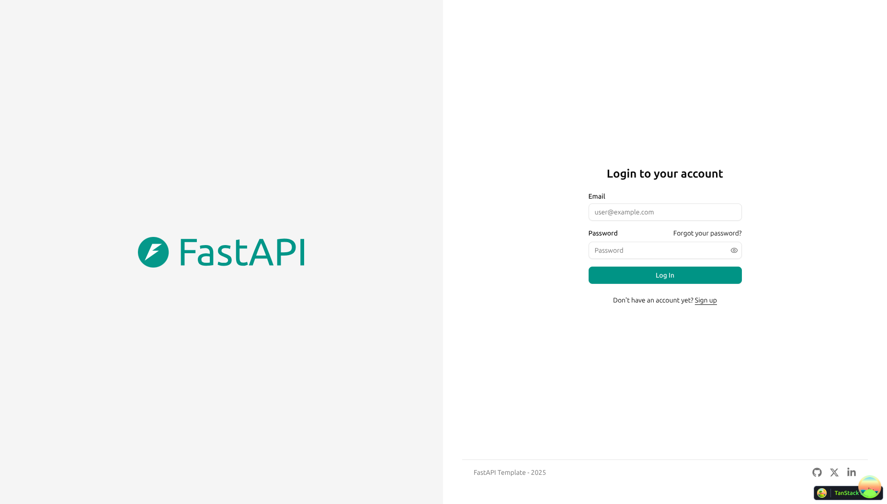

# Dashboard Full Stack com FastAPI

<a href="https://github.com/fastapi/full-stack-fastapi-template/actions?query=workflow%3A%22Test+Docker+Compose%22" target="_blank"></a>
<a href="https://github.com/fastapi/full-stack-fastapi-template/actions?query=workflow%3A%22Test+Backend%22" target="_blank"></a>
<a href="https://coverage-badge.samuelcolvin.workers.dev/redirect/fastapi/full-stack-fastapi-template" target="_blank"></a>

## Stack e Funcionalidades

- ⚡ **API em Python** com [FastAPI](https://fastapi.tiangolo.com).
  - 🧰 ORM baseado em **SQLAlchemy** (com uso de SQLModel na base).
  - 🔍 [Pydantic](https://docs.pydantic.dev) para validação e configurações.
  - 💾 [PostgreSQL](https://www.postgresql.org) como banco relacional.
  - 🔑 Autenticação **OAuth2** com tokens.
- 🚀 **Dashboard** em [React](https://react.dev), com abordagem compatível com **Next.js**.
  - 💃 TypeScript, hooks, [Vite](https://vitejs.dev) e front-end moderno.
  - 🎨 [Tailwind CSS](https://tailwindcss.com) e [shadcn/ui](https://ui.shadcn.com) para componentes.
  - 🧠 Gestão de estado com **Zustand**.
  - 🤖 Cliente frontend gerado automaticamente.
  - 🧪 [Playwright](https://playwright.dev) para testes end-to-end.
  - 🦇 Suporte a modo escuro.
- ⚡ **Cache com Redis** (implantação via Docker Compose quando habilitado).
- ✅ **Testes unitários e de integração** com [Pytest](https://pytest.org) (backend) e **Jest** (frontend).
- 🐋 **Conteinerização** com Docker, incluindo `Dockerfile` e `docker-compose.yml`.
  - Neste projeto, o arquivo principal é `compose.yml`, equivalente ao `docker-compose.yml`.
- 📞 [Traefik](https://traefik.io) como proxy reverso / balanceador.
- 📫 Recuperação de senha por e-mail.
- 📬 [Mailcatcher](https://mailcatcher.me) para testes locais de e-mail.
- 🏭 CI/CD com GitHub Actions.

## Login do Dashboard

[](https://github.com/fastapi/full-stack-fastapi-template)

## Dashboard - Administração

[](https://github.com/fastapi/full-stack-fastapi-template)

## Dashboard - Itens

[](https://github.com/fastapi/full-stack-fastapi-template)

## Dashboard - Modo Escuro

[](https://github.com/fastapi/full-stack-fastapi-template)

## Documentação Interativa da API

[](https://github.com/fastapi/full-stack-fastapi-template)

## Como Usar

Você pode **apenas clonar** este repositório e usar como base do seu **dashboard**.

✨ Funciona de forma imediata. ✨

### Como usar em um repositório privado

Se você quer um repositório privado, o GitHub não permite apenas “forkar” e mudar a visibilidade.

Você pode fazer o seguinte:

- Crie um novo repositório, por exemplo `meu-dashboard`.
- Clone este repositório manualmente, com o nome do seu projeto:

```bash
git clone git@github.com:fastapi/full-stack-fastapi-template.git meu-dashboard
```

- Entre no novo diretório:

```bash
cd meu-dashboard
```

- Defina o novo `origin` com o repositório criado:

```bash
git remote set-url origin git@github.com:octocat/meu-dashboard.git
```

- Adicione este repositório como `upstream` para receber atualizações:

```bash
git remote add upstream git@github.com:fastapi/full-stack-fastapi-template.git
```

- Envie o código para o seu repositório:

```bash
git push -u origin master
```

### Atualizar a partir do template original

Depois de clonar e customizar, você pode querer puxar mudanças do template original.

- Garanta que o repositório original está como `upstream`:

```bash
git remote -v
```

- Baixe as mudanças sem mesclar automaticamente:

```bash
git pull --no-commit upstream master
```

Isso baixa as mudanças sem commit, permitindo revisar antes de mesclar.

- Se houver conflitos, resolva no editor.
- Quando terminar, finalize o merge:

```bash
git merge --continue
```

### Configuração

Atualize as configurações no `.env` conforme sua necessidade.

Antes de rodar/implantar, **mude no mínimo**:

- `SECRET_KEY`
- `FIRST_SUPERUSER_PASSWORD`
- `POSTGRES_PASSWORD`

Você pode (e deve) usar variáveis de ambiente via secrets.

Leia [deployment.md](./deployment.md) para mais detalhes.

### Gerar chaves secretas

Algumas variáveis no `.env` vêm com `changethis`.

Você deve alterá-las. Para gerar chaves seguras, use:

```bash
python -c "import secrets; print(secrets.token_urlsafe(32))"
```

Copie o valor gerado e use como senha/secret. Rode novamente para gerar outra chave.

## Como usar - alternativa com Copier

Este repositório também suporta gerar um novo projeto com [Copier](https://copier.readthedocs.io).

Ele copia os arquivos, faz perguntas de configuração e atualiza o `.env`.

### Instalar o Copier

Você pode instalar com:

```bash
pip install copier
```

Ou, se tiver [`pipx`](https://pipx.pypa.io/), use:

```bash
pipx install copier
```

**Nota**: com `pipx`, a instalação é opcional.

### Gerar um projeto com Copier

Defina o nome do diretório do projeto, por exemplo `meu-dashboard`.

Vá para o diretório pai e execute o comando com o nome do projeto:

```bash
copier copy https://github.com/fastapi/full-stack-fastapi-template meu-dashboard --trust
```

Se você tem `pipx` e não instalou o `copier`, rode direto:

```bash
pipx run copier copy https://github.com/fastapi/full-stack-fastapi-template meu-dashboard --trust
```

**Nota**: a opção `--trust` é necessária para executar o script de pós-criação que atualiza o `.env`.

### Variáveis de entrada

O Copier fará perguntas; tenha essas informações em mãos.

Você pode ajustar tudo depois no `.env`.

Variáveis (com valores padrão):

- `project_name`: (padrão: `"FastAPI Project"`) Nome do projeto exibido na API.
- `stack_name`: (padrão: `"fastapi-project"`) Nome da stack do Docker Compose.
- `secret_key`: (padrão: `"changethis"`) Chave secreta do projeto.
- `first_superuser`: (padrão: `"admin@example.com"`) E-mail do superusuário inicial.
- `first_superuser_password`: (padrão: `"changethis"`) Senha do superusuário inicial.
- `smtp_host`: (padrão: "") Host SMTP.
- `smtp_user`: (padrão: "") Usuário SMTP.
- `smtp_password`: (padrão: "") Senha SMTP.
- `emails_from_email`: (padrão: `"info@example.com"`) E-mail remetente.
- `postgres_password`: (padrão: `"changethis"`) Senha do PostgreSQL.
- `sentry_dsn`: (padrão: "") DSN do Sentry.

## Desenvolvimento do Backend

Docs do backend: [backend/README.md](./backend/README.md).

## Desenvolvimento do Frontend

Docs do frontend: [frontend/README.md](./frontend/README.md).

## Implantação

Docs de implantação: [deployment.md](./deployment.md).

## Desenvolvimento

Docs gerais: [development.md](./development.md).

Inclui Docker Compose, domínios locais, `.env`, etc.

## Notas de Versão

Confira [release-notes.md](./release-notes.md).

## Licença

Este projeto é licenciado sob a licença MIT.

## Login de teste

Use o usuário inicial configurado no `.env`:

- E-mail: `admin@example.com`
- Senha: valor de `FIRST_SUPERUSER_PASSWORD` (padrão: `changethis`)# Dashboard Full Stack com FastAPI

<a href="https://github.com/fastapi/full-stack-fastapi-template/actions?query=workflow%3A%22Test+Docker+Compose%22" target="_blank"></a>
## Stack e Funcionalidades

- ⚡ [**FastAPI**](https://fastapi.tiangolo.com) para a API em Python.
  - 🧰 ORM baseado em **SQLAlchemy** (com uso de SQLModel na base).
  - 🔍 [Pydantic](https://docs.pydantic.dev) para validação e configuração.
  - 💾 [PostgreSQL](https://www.postgresql.org) como banco relacional.
- 🚀 **Dashboard** em [React](https://react.dev) com abordagem compatível com **Next.js**.
  - 💃 TypeScript, hooks, [Vite](https://vitejs.dev) e front-end moderno.
  - 🎨 [Tailwind CSS](https://tailwindcss.com) e [shadcn/ui](https://ui.shadcn.com) para componentes.
  - 🧠 Gestão de estado com **Zustand**.
  - 🧪 [Playwright](https://playwright.dev) para testes end-to-end.
  - 🦇 Suporte a modo escuro.
- 🐋 [Docker Compose](https://www.docker.com) para desenvolvimento e produção.
- 🔒 Hash seguro de senhas.
- 🔑 Autenticação **OAuth2** com tokens.
- 📫 Recuperação de senha por e-mail.
- 📬 [Mailcatcher](https://mailcatcher.me) para testes locais de e-mail.
- ✅ Testes unitários e de integração com [Pytest](https://pytest.org) (backend) e **Jest** (frontend).
- 📞 [Traefik](https://traefik.io) como proxy reverso / balanceador.
- 🚢 Instruções de implantação com Docker Compose (incluindo proxy Traefik para HTTPS).
- 🏭 CI/CD com GitHub Actions.

## Login do Dashboard
## Dashboard - Administração

## Dashboard - Itens
## Dashboard - Modo Escuro

## Documentação Interativa da API
## Como Usar

Você pode **apenas clonar** este repositório e usar como base do seu **dashboard**.
✨ Funciona de forma imediata. ✨

### Como usar em um repositório privado
Se você quer um repositório privado, o GitHub não permite apenas “forkar” e mudar a visibilidade.

Você pode fazer o seguinte:
- Crie um novo repositório, por exemplo `meu-dashboard`.
- Clone este repositório manualmente, com o nome do seu projeto:
- Entre no novo diretório:

- Defina o novo `origin` com o repositório criado:
- Adicione este repositório como `upstream` para receber atualizações:

- Envie o código para o seu repositório:
### Atualizar a partir do template original

Depois de clonar e customizar, você pode querer puxar mudanças do template original.
- Garanta que o repositório original está como `upstream`:

- Baixe as mudanças sem mesclar automaticamente:
Isso baixa as mudanças sem commit, permitindo revisar antes de mesclar.

- Se houver conflitos, resolva no editor.
- Quando terminar, finalize o merge:

### Configuração
Atualize as configurações no `.env` conforme sua necessidade.

Antes de rodar/implantar, **mude no mínimo**:
- `SECRET_KEY`
- `FIRST_SUPERUSER_PASSWORD`
- `POSTGRES_PASSWORD`
Você pode (e deve) usar variáveis de ambiente via secrets.

Leia [deployment.md](./deployment.md) para mais detalhes.
### Gerar chaves secretas

Algumas variáveis no `.env` vêm com `changethis`.
Você deve alterá-las. Para gerar chaves seguras, use:

```bash
python -c "import secrets; print(secrets.token_urlsafe(32))"
```
Copie o valor gerado e use como senha/secret. Rode novamente para gerar outra chave.

## Como usar - alternativa com Copier
Este repositório também suporta gerar um novo projeto com [Copier](https://copier.readthedocs.io).

Ele copia os arquivos, faz perguntas de configuração e atualiza o `.env`.
### Instalar o Copier

Você pode instalar com:
Ou, se tiver [`pipx`](https://pipx.pypa.io/), use:

**Nota**: com `pipx`, a instalação é opcional.
### Gerar um projeto com Copier

Defina o nome do diretório do projeto, por exemplo `meu-dashboard`.
Vá para o diretório pai e execute o comando com o nome do projeto:

Se você tem `pipx` e não instalou o `copier`, rode direto:
**Nota**: a opção `--trust` é necessária para executar o script de pós-criação que atualiza o `.env`.

### Variáveis de entrada
O Copier fará perguntas; tenha essas informações em mãos.

Você pode ajustar tudo depois no `.env`.
Variáveis (com valores padrão):

- `project_name`: (padrão: `"FastAPI Project"`) Nome do projeto exibido na API.
- `stack_name`: (padrão: `"fastapi-project"`) Nome da stack do Docker Compose.
- `secret_key`: (padrão: `"changethis"`) Chave secreta do projeto.
- `first_superuser`: (padrão: `"admin@example.com"`) E-mail do superusuário inicial.
- `first_superuser_password`: (padrão: `"changethis"`) Senha do superusuário inicial.
- `smtp_host`: (padrão: "") Host SMTP.
- `smtp_user`: (padrão: "") Usuário SMTP.
- `smtp_password`: (padrão: "") Senha SMTP.
- `emails_from_email`: (padrão: `"info@example.com"`) E-mail remetente.
- `postgres_password`: (padrão: `"changethis"`) Senha do PostgreSQL.
- `sentry_dsn`: (padrão: "") DSN do Sentry.
## Desenvolvimento do Backend

Docs do backend: [backend/README.md](./backend/README.md).
## Desenvolvimento do Frontend

Docs do frontend: [frontend/README.md](./frontend/README.md).
## Implantação

Docs de implantação: [deployment.md](./deployment.md).
## Desenvolvimento

Docs gerais: [development.md](./development.md).
Inclui Docker Compose, domínios locais, `.env`, etc.

## Notas de Versão
Confira [release-notes.md](./release-notes.md).

## Licença
Este projeto é licenciado sob a licença MIT.

## Login de teste

Use o usuário inicial configurado no `.env`:

- E-mail: `admin@example.com`
- Senha: valor de `FIRST_SUPERUSER_PASSWORD` (padrão: `changethis`)
# Full Stack FastAPI Template

<a href="https://github.com/fastapi/full-stack-fastapi-template/actions?query=workflow%3A%22Test+Docker+Compose%22" target="_blank"></a>
<a href="https://github.com/fastapi/full-stack-fastapi-template/actions?query=workflow%3A%22Test+Backend%22" target="_blank"></a>
<a href="https://coverage-badge.samuelcolvin.workers.dev/redirect/fastapi/full-stack-fastapi-template" target="_blank"></a>

